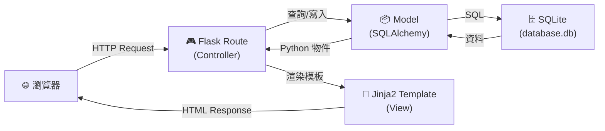
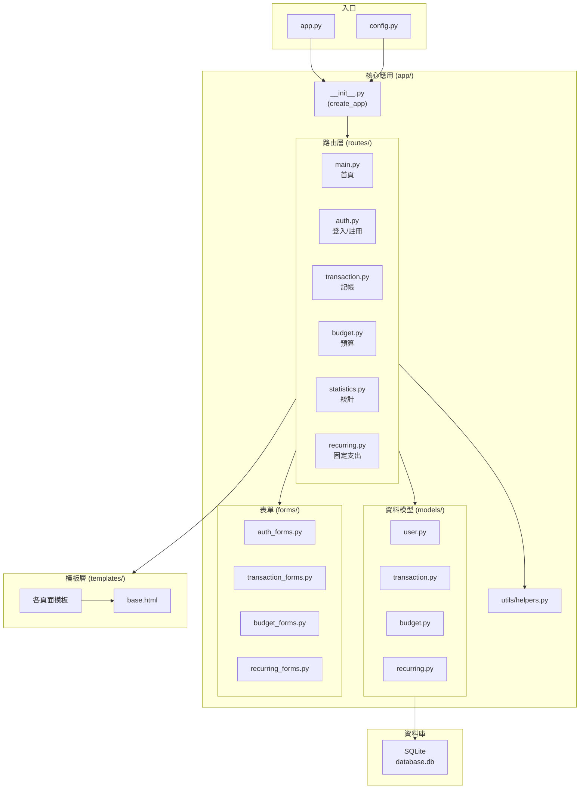

# 個人記帳簿 — 系統架構設計文件

> **版本**：v1.0  
> **建立日期**：2026-04-23  
> **對應 PRD**：docs/PRD.md  

---

## 1. 技術架構說明

### 1.1 選用技術與原因

| 技術 | 角色 | 選用原因 |
|------|------|---------|
| **Python 3** | 程式語言 | 語法簡潔易學，適合學生與快速開發 |
| **Flask** | 後端框架 | 輕量級微框架，結構自由、學習曲線低，適合中小型專案 |
| **Jinja2** | 模板引擎 | Flask 內建，支援模板繼承與自動 XSS 轉義，安全又方便 |
| **SQLite** | 資料庫 | 零組態、單檔案資料庫，免安裝伺服器，適合個人應用 |
| **SQLAlchemy** | ORM | 以 Python 物件操作資料庫，免寫原生 SQL，降低 SQL Injection 風險 |
| **Flask-Login** | 身份驗證 | 提供 session 管理、登入保護裝飾器，整合簡單 |
| **Flask-WTF** | 表單處理 | 表單驗證 + CSRF 防護一次搞定 |
| **Chart.js** | 前端圖表 | 輕量 JavaScript 圖表庫，支援圓餅圖、長條圖，CDN 引入即可使用 |
| **HTML5 + CSS3 + JS** | 前端 | 不需前後端分離，由 Flask + Jinja2 直接渲染頁面 |

### 1.2 Flask MVC 模式說明

本專案採用 **MVC（Model-View-Controller）** 架構模式，各層職責明確分離：

```
┌─────────────────────────────────────────────────────────┐
│                      瀏覽器 (Browser)                     │
│                  使用者在此操作介面                         │
└──────────────┬──────────────────────┬────────────────────┘
               │ HTTP Request        │ HTTP Response (HTML)
               ▼                     │
┌──────────────────────────┐         │
│   Controller (路由層)     │         │
│   app/routes/*.py        │         │
│                          │         │
│  • 接收使用者請求         │         │
│  • 呼叫 Model 存取資料    │         │
│  • 選擇 View 渲染回傳     │─────────┘
└──────┬───────────────────┘
       │ 資料操作
       ▼
┌──────────────────────────┐    ┌──────────────────────────┐
│   Model (資料模型層)      │    │   View (模板層)           │
│   app/models/*.py        │    │   app/templates/*.html   │
│                          │    │                          │
│  • 定義資料表結構         │    │  • HTML + Jinja2 語法     │
│  • 封裝資料庫 CRUD 操作   │    │  • 接收 Controller 傳入   │
│  • 商業邏輯處理           │    │    的資料並渲染成 HTML     │
└──────┬───────────────────┘    └──────────────────────────┘
       │ SQL 查詢
       ▼
┌──────────────────────────┐
│   SQLite 資料庫           │
│   instance/database.db   │
└──────────────────────────┘
```

| 層級 | 對應位置 | 職責 |
|------|---------|------|
| **Model** | `app/models/` | 定義資料庫表格結構（User、Transaction、Budget、Recurring），封裝資料存取邏輯 |
| **View** | `app/templates/` | Jinja2 HTML 模板，負責將資料呈現為使用者看到的頁面 |
| **Controller** | `app/routes/` | Flask 路由函式，負責接收請求、調用 Model、選擇 Template 回傳 |

---

## 2. 專案資料夾結構

```
web_app_development2/
│
├── docs/                          # 📄 專案文件
│   ├── PRD.md                     #    產品需求文件
│   ├── ARCHITECTURE.md            #    系統架構文件（本文件）
│   ├── FLOWCHART.md               #    流程圖文件
│   ├── DB_SCHEMA.md               #    資料庫設計文件
│   └── API_DESIGN.md              #    路由與 API 設計文件
│
├── app/                           # 🏠 應用程式主目錄
│   ├── __init__.py                #    Flask App 工廠函式（create_app）
│   │
│   ├── models/                    # 📦 Model 層 — 資料庫模型
│   │   ├── __init__.py            #    匯出所有 Model
│   │   ├── user.py                #    使用者模型（帳號、密碼雜湊）
│   │   ├── transaction.py         #    交易紀錄模型（收入/支出）
│   │   ├── budget.py              #    預算模型（月預算、分類預算）
│   │   └── recurring.py           #    週期性支出模型
│   │
│   ├── routes/                    # 🎮 Controller 層 — Flask 路由
│   │   ├── __init__.py            #    註冊所有 Blueprint
│   │   ├── main.py                #    首頁 / 儀表板路由
│   │   ├── auth.py                #    註冊、登入、登出路由
│   │   ├── transaction.py         #    記帳 CRUD 路由
│   │   ├── budget.py              #    預算設定路由
│   │   ├── statistics.py          #    統計分析路由
│   │   └── recurring.py           #    週期性支出路由
│   │
│   ├── templates/                 # 🎨 View 層 — Jinja2 HTML 模板
│   │   ├── base.html              #    基礎版面（導覽列、頁尾、共用 CSS/JS）
│   │   ├── index.html             #    首頁儀表板
│   │   ├── auth/                  #    身份驗證頁面
│   │   │   ├── login.html         #       登入頁
│   │   │   └── register.html      #       註冊頁
│   │   ├── transaction/           #    交易紀錄頁面
│   │   │   ├── create.html        #       新增帳目表單
│   │   │   ├── edit.html          #       編輯帳目表單
│   │   │   └── list.html          #       歷史帳目列表（含搜尋）
│   │   ├── budget/                #    預算相關頁面
│   │   │   └── settings.html      #       預算設定頁
│   │   ├── statistics/            #    統計分析頁面
│   │   │   └── overview.html      #       圓餅圖統計頁
│   │   └── recurring/             #    週期性支出頁面
│   │       └── manage.html        #       管理固定支出
│   │
│   ├── static/                    # 📁 靜態資源
│   │   ├── css/
│   │   │   └── style.css          #    全站樣式
│   │   ├── js/
│   │   │   ├── main.js            #    共用 JavaScript
│   │   │   └── chart.js           #    圓餅圖初始化與互動
│   │   └── images/                #    圖片資源（Logo 等）
│   │
│   ├── forms/                     # 📝 WTForms 表單定義
│   │   ├── __init__.py
│   │   ├── auth_forms.py          #    登入 / 註冊表單
│   │   ├── transaction_forms.py   #    記帳表單
│   │   ├── budget_forms.py        #    預算設定表單
│   │   └── recurring_forms.py     #    週期性支出表單
│   │
│   └── utils/                     # 🔧 工具函式
│       ├── __init__.py
│       └── helpers.py             #    日期處理、金額格式化等輔助函式
│
├── instance/                      # 🗄️ 實例資料（不進版控）
│   └── database.db                #    SQLite 資料庫檔案
│
├── app.py                         # 🚀 應用程式入口（啟動伺服器）
├── config.py                      # ⚙️ 組態設定（SECRET_KEY、DB 路徑等）
├── requirements.txt               # 📋 Python 套件依賴清單
├── .gitignore                     # 🚫 Git 忽略規則
└── README.md                      # 📖 專案說明
```

### 各目錄職責說明

| 目錄 / 檔案 | 職責 |
|-------------|------|
| `app/__init__.py` | Flask 應用程式工廠，初始化 DB、Login Manager、Blueprint 註冊 |
| `app/models/` | 定義所有 SQLAlchemy 資料模型，封裝資料庫操作 |
| `app/routes/` | 所有 Flask Blueprint 路由，處理 HTTP 請求與回應 |
| `app/templates/` | Jinja2 模板，使用 `base.html` 繼承機制統一版面 |
| `app/static/` | CSS、JavaScript、圖片等靜態檔案 |
| `app/forms/` | Flask-WTF 表單類別，處理表單驗證與 CSRF 防護 |
| `app/utils/` | 共用工具函式（日期格式化、分頁計算等） |
| `instance/` | SQLite 資料庫檔案存放處（不進版控） |
| `config.py` | 組態設定，區分開發 / 生產環境 |

---

## 3. 元件關係圖

### 3.1 請求處理流程



### 3.2 模組依賴關係



### 3.3 功能模組對照表

| 功能 | Route | Model | Template | Form |
|------|-------|-------|----------|------|
| 快速記帳 | `transaction.py` | `Transaction` | `transaction/create.html` | `transaction_forms.py` |
| 餘額概況 | `main.py` | `Transaction` | `index.html` | — |
| 預算警示 | `budget.py` + `main.py` | `Budget` | `budget/settings.html` + `index.html` | `budget_forms.py` |
| 圓餅圖統計 | `statistics.py` | `Transaction` | `statistics/overview.html` | — |
| 歷史搜尋編輯 | `transaction.py` | `Transaction` | `transaction/list.html` + `edit.html` | `transaction_forms.py` |
| 固定支出提醒 | `recurring.py` + `main.py` | `Recurring` | `recurring/manage.html` + `index.html` | `recurring_forms.py` |
| 使用者驗證 | `auth.py` | `User` | `auth/login.html` + `register.html` | `auth_forms.py` |

---

## 4. 關鍵設計決策

### 決策一：使用 Application Factory 模式

**選擇**：採用 `create_app()` 工廠函式建立 Flask 應用程式

**原因**：
- 可在不同環境（開發 / 測試 / 生產）使用不同組態
- 避免循環引入問題（circular import）
- Flask 官方推薦做法，有利後續擴充

```python
# app/__init__.py
def create_app(config_name='default'):
    app = Flask(__name__)
    app.config.from_object(config[config_name])
    
    db.init_app(app)
    login_manager.init_app(app)
    
    # 註冊 Blueprint
    from app.routes import main, auth, transaction, budget, statistics, recurring
    app.register_blueprint(main.bp)
    app.register_blueprint(auth.bp)
    # ...
    
    return app
```

---

### 決策二：使用 Blueprint 拆分路由

**選擇**：每個功能模組各自一個 Blueprint

**原因**：
- 路由不集中在單一檔案，易於團隊分工
- 每個 Blueprint 可獨立測試
- URL prefix 可靈活調整，例如 `/auth/login`、`/budget/settings`

---

### 決策三：使用 SQLAlchemy ORM 而非原生 SQL

**選擇**：以 SQLAlchemy 定義 Model，操作資料庫

**原因**：
- 以 Python 物件操作資料表，程式碼更直覺
- 自動參數化查詢，有效防範 SQL Injection
- 內建資料遷移支援（搭配 Flask-Migrate）
- 學生不需精通 SQL 語法也能完成 CRUD

---

### 決策四：模板繼承機制

**選擇**：所有頁面繼承 `base.html` 基礎模板

**原因**：
- 導覽列、頁尾、CSS/JS 引入只需寫一次
- 各頁面只需定義 `` 區塊
- 修改整站風格只需改 `base.html`，維護成本低

```html
<!-- base.html -->
<!DOCTYPE html>
<html>
<head>
    <link rel="stylesheet" href="{{ url_for('static', filename='css/style.css') }}">
    <title>個人記帳簿</title>
</head>
<body>
    <nav><!-- 共用導覽列 --></nav>
    <main></main>
    <footer><!-- 共用頁尾 --></footer>
    <script src="https://cdn.jsdelivr.net/npm/chart.js"></script>
    
</body>
</html>
```

---

### 決策五：Chart.js 透過 CDN 引入

**選擇**：使用 CDN 載入 Chart.js，不安裝到專案內

**原因**：
- 免 npm 安裝流程，減少專案複雜度
- CDN 有快取機制，載入速度快
- 只需在需要圖表的頁面引入，不影響其他頁面效能
- 版本固定於 CDN URL，確保穩定

```html
<!-- 僅在統計頁面引入 -->
<script src="https://cdn.jsdelivr.net/npm/chart.js@4"></script>
```

---

## 5. 組態管理

### config.py 結構

```python
import os

basedir = os.path.abspath(os.path.dirname(__file__))

class Config:
    """基礎組態"""
    SECRET_KEY = os.environ.get('SECRET_KEY') or 'dev-secret-key-change-in-production'
    SQLALCHEMY_DATABASE_URI = 'sqlite:///' + os.path.join(basedir, 'instance', 'database.db')
    SQLALCHEMY_TRACK_MODIFICATIONS = False
    
    # 分頁設定
    ITEMS_PER_PAGE = 10
    
    # 預算警示門檻
    BUDGET_WARNING_THRESHOLD = 0.8   # 80% 黃色警示
    BUDGET_DANGER_THRESHOLD = 1.0    # 100% 紅色警示

class DevelopmentConfig(Config):
    """開發環境"""
    DEBUG = True

class ProductionConfig(Config):
    """生產環境"""
    DEBUG = False

config = {
    'development': DevelopmentConfig,
    'production': ProductionConfig,
    'default': DevelopmentConfig
}
```

---

## 6. 第三方套件清單

### requirements.txt

```
Flask==3.1.*
Flask-SQLAlchemy==3.1.*
Flask-Login==0.6.*
Flask-WTF==1.2.*
Werkzeug==3.1.*
```

> 📌 Chart.js 透過 CDN 引入，不需列入 Python 套件。

---

## 7. 安全機制摘要

| 威脅 | 防護方式 | 實作方式 |
|------|---------|---------|
| **CSRF** | Token 驗證 | Flask-WTF 自動在表單加入隱藏 token |
| **SQL Injection** | 參數化查詢 | SQLAlchemy ORM 自動處理 |
| **XSS** | 自動轉義 | Jinja2 預設開啟 `autoescape` |
| **密碼外洩** | 雜湊儲存 | `werkzeug.security.generate_password_hash()` |
| **未授權存取** | 登入保護 | `@login_required` 裝飾器 |

---

> 📌 **下一步**：本文件確認後，進入 **流程圖設計（Flowchart）** 階段。
