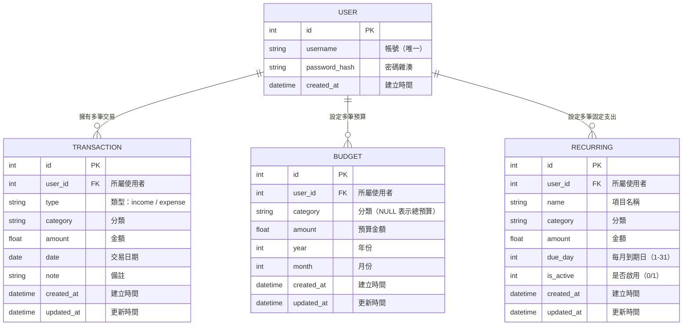

# 個人記帳簿 — 資料庫設計文件

> **版本**：v1.0  
> **建立日期**：2026-04-23  
> **對應文件**：docs/PRD.md、docs/ARCHITECTURE.md、docs/FLOWCHART.md  

---

## 1. ER 圖（實體關係圖）

### 關聯說明

| 關聯 | 類型 | 說明 |
|------|------|------|
| USER → TRANSACTION | 一對多 | 一個使用者擁有多筆交易紀錄 |
| USER → BUDGET | 一對多 | 一個使用者可設定多筆預算（總預算 + 各分類預算） |
| USER → RECURRING | 一對多 | 一個使用者可設定多筆週期性固定支出 |

---

## 2. 資料表詳細說明

### 2.1 users — 使用者資料表

儲存使用者帳號與驗證資訊。

| 欄位 | 型別 | 必填 | 說明 |
|------|------|------|------|
| `id` | INTEGER | ✅ | 主鍵，自動遞增 |
| `username` | TEXT | ✅ | 帳號，唯一不可重複 |
| `password_hash` | TEXT | ✅ | 密碼雜湊值（werkzeug 產生） |
| `created_at` | DATETIME | ✅ | 帳號建立時間，預設為當前時間 |

- **Primary Key**：`id`
- **Unique**：`username`

---

### 2.2 transactions — 交易紀錄資料表

儲存每一筆收入或支出的帳目紀錄。

| 欄位 | 型別 | 必填 | 說明 |
|------|------|------|------|
| `id` | INTEGER | ✅ | 主鍵，自動遞增 |
| `user_id` | INTEGER | ✅ | 外鍵，關聯到 `users.id` |
| `type` | TEXT | ✅ | 交易類型：`income`（收入）或 `expense`（支出） |
| `category` | TEXT | ✅ | 分類名稱（餐飲、交通、娛樂…） |
| `amount` | REAL | ✅ | 金額（正數） |
| `date` | DATE | ✅ | 交易日期 |
| `note` | TEXT | ❌ | 備註說明（可為空） |
| `created_at` | DATETIME | ✅ | 紀錄建立時間 |
| `updated_at` | DATETIME | ✅ | 紀錄更新時間 |

- **Primary Key**：`id`
- **Foreign Key**：`user_id` → `users(id)`

#### 預設分類清單

| 收入分類 | 支出分類 |
|---------|---------|
| 薪資 | 餐飲 |
| 打工 | 交通 |
| 獎學金 | 娛樂 |
| 投資 | 購物 |
| 其他收入 | 居住 |
| | 醫療 |
| | 教育 |
| | 其他支出 |

---

### 2.3 budgets — 預算設定資料表

儲存使用者每月的總預算與各分類預算設定。

| 欄位 | 型別 | 必填 | 說明 |
|------|------|------|------|
| `id` | INTEGER | ✅ | 主鍵，自動遞增 |
| `user_id` | INTEGER | ✅ | 外鍵，關聯到 `users.id` |
| `category` | TEXT | ❌ | 分類名稱；`NULL` 表示「每月總預算」 |
| `amount` | REAL | ✅ | 預算金額 |
| `year` | INTEGER | ✅ | 年份（例如 2026） |
| `month` | INTEGER | ✅ | 月份（1-12） |
| `created_at` | DATETIME | ✅ | 建立時間 |
| `updated_at` | DATETIME | ✅ | 更新時間 |

- **Primary Key**：`id`
- **Foreign Key**：`user_id` → `users(id)`
- **Unique**：`(user_id, category, year, month)` — 同一使用者同月同分類只能有一筆預算

---

### 2.4 recurring — 週期性固定支出資料表

儲存使用者設定的每月固定支出項目。

| 欄位 | 型別 | 必填 | 說明 |
|------|------|------|------|
| `id` | INTEGER | ✅ | 主鍵，自動遞增 |
| `user_id` | INTEGER | ✅ | 外鍵，關聯到 `users.id` |
| `name` | TEXT | ✅ | 項目名稱（例如：房租、水電費） |
| `category` | TEXT | ✅ | 分類名稱 |
| `amount` | REAL | ✅ | 金額 |
| `due_day` | INTEGER | ✅ | 每月到期日（1-31） |
| `is_active` | INTEGER | ✅ | 是否啟用提醒（1=啟用, 0=暫停），預設 1 |
| `created_at` | DATETIME | ✅ | 建立時間 |
| `updated_at` | DATETIME | ✅ | 更新時間 |

- **Primary Key**：`id`
- **Foreign Key**：`user_id` → `users(id)`

---

## 3. 索引設計

為了提升查詢效能，建立以下索引：

| 索引名稱 | 資料表 | 欄位 | 用途 |
|---------|--------|------|------|
| `idx_transactions_user_id` | transactions | `user_id` | 加速依使用者查詢交易 |
| `idx_transactions_date` | transactions | `date` | 加速依日期範圍篩選 |
| `idx_transactions_category` | transactions | `category` | 加速依分類篩選與統計 |
| `idx_transactions_type` | transactions | `type` | 加速收入/支出分類統計 |
| `idx_budgets_user_month` | budgets | `user_id, year, month` | 加速查詢特定月份預算 |
| `idx_recurring_user_id` | recurring | `user_id` | 加速依使用者查詢固定支出 |

---

## 4. 檔案對照

| 產出檔案 | 路徑 | 說明 |
|---------|------|------|
| SQL 建表語法 | `database/schema.sql` | 完整的 CREATE TABLE + INDEX SQL |
| User Model | `app/models/user.py` | 使用者模型 |
| Transaction Model | `app/models/transaction.py` | 交易紀錄模型 |
| Budget Model | `app/models/budget.py` | 預算模型 |
| Recurring Model | `app/models/recurring.py` | 週期性支出模型 |
| Models Init | `app/models/__init__.py` | 匯出所有 Model |

---

> 📌 **下一步**：本文件確認後，進入 **API 設計（API Design）** 階段。
