# 個人記帳簿 — 流程圖文件

> **版本**：v1.0  
> **建立日期**：2026-04-23  
> **對應文件**：docs/PRD.md、docs/ARCHITECTURE.md  

---

## 1. 使用者流程圖（User Flow）

### 1.1 整體操作流程

使用者從進入網站到完成各項功能的操作路徑：

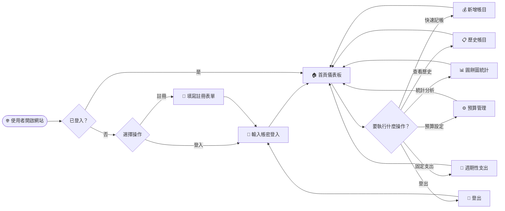

---

### 1.2 快速記帳流程

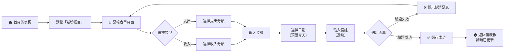

---

### 1.3 歷史帳目搜尋與編輯流程

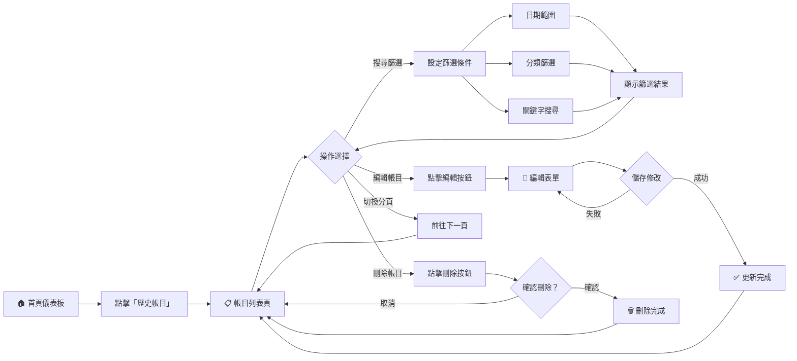

---

### 1.4 預算設定與警示流程

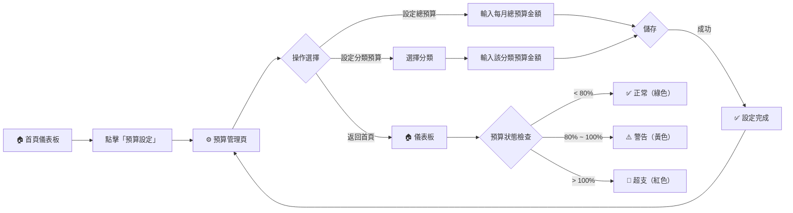

---

### 1.5 統計分析流程

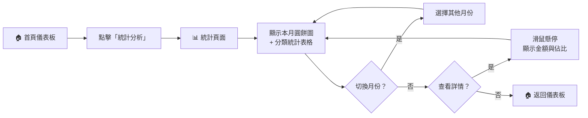

---

### 1.6 週期性固定支出流程

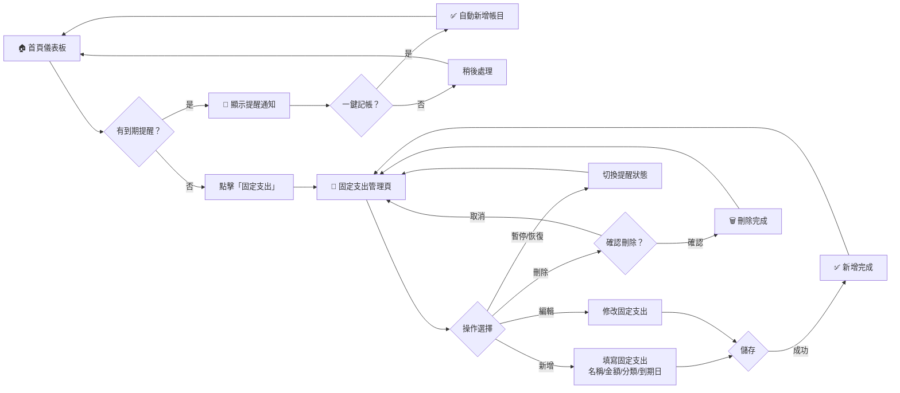

---

### 1.7 使用者註冊與登入流程

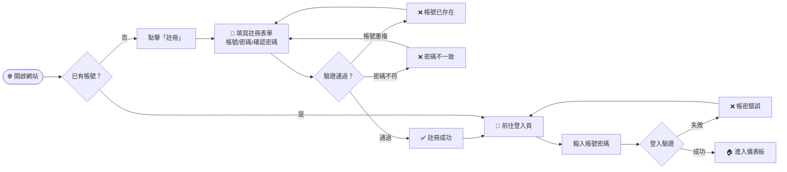

---

## 2. 系統序列圖（Sequence Diagram）

### 2.1 快速記帳序列圖

描述使用者新增一筆帳目的完整資料流：

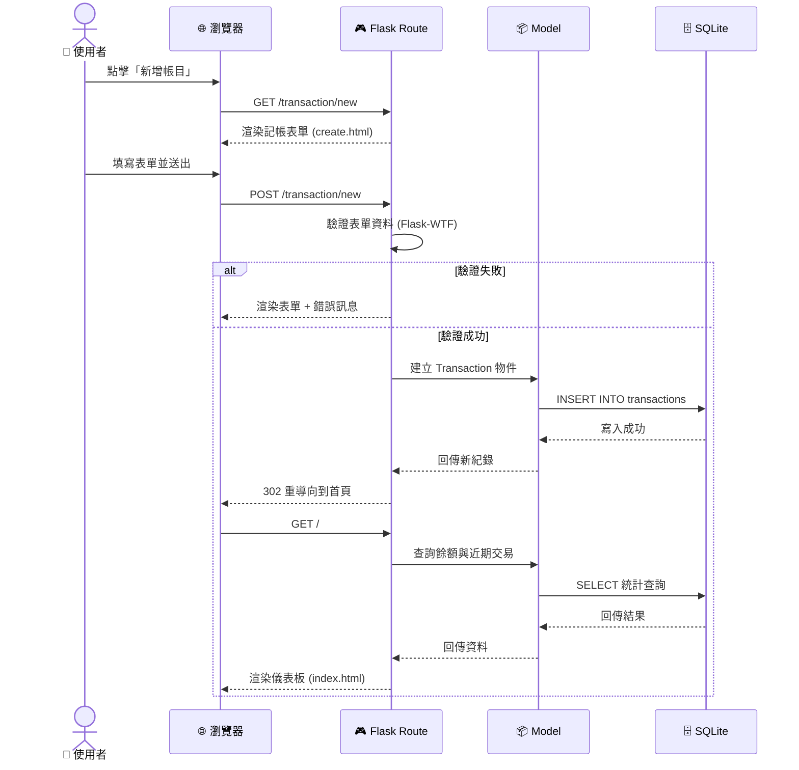

---

### 2.2 歷史帳目搜尋序列圖

描述使用者搜尋並編輯帳目的資料流：

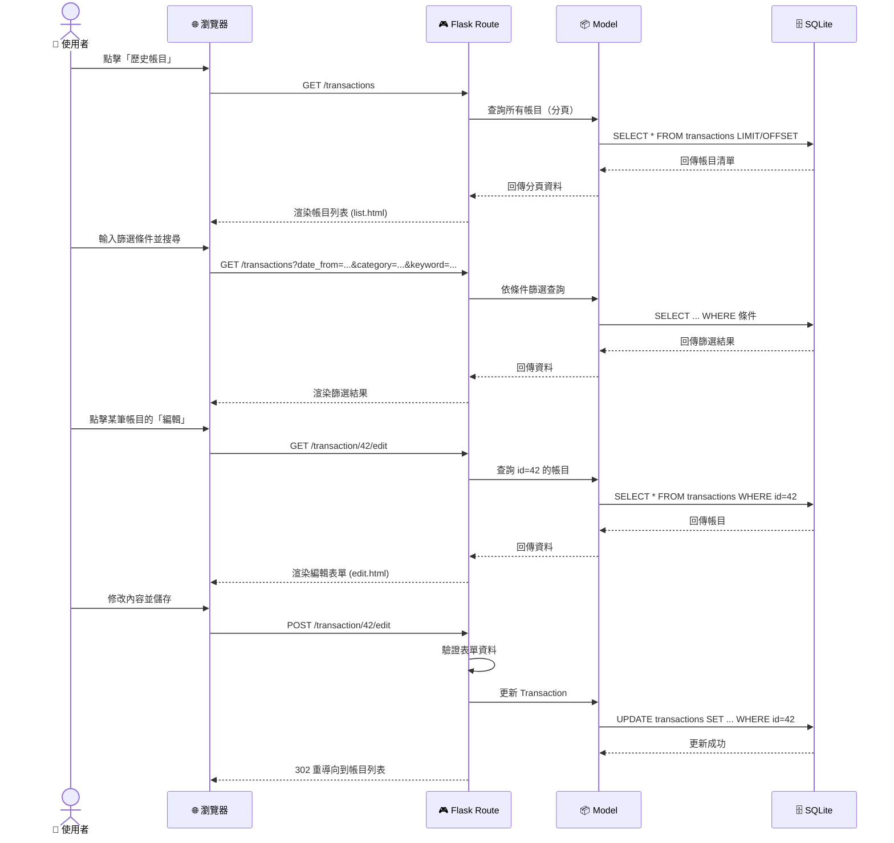

---

### 2.3 預算警示檢查序列圖

描述首頁儀表板載入時，系統如何檢查預算狀態：

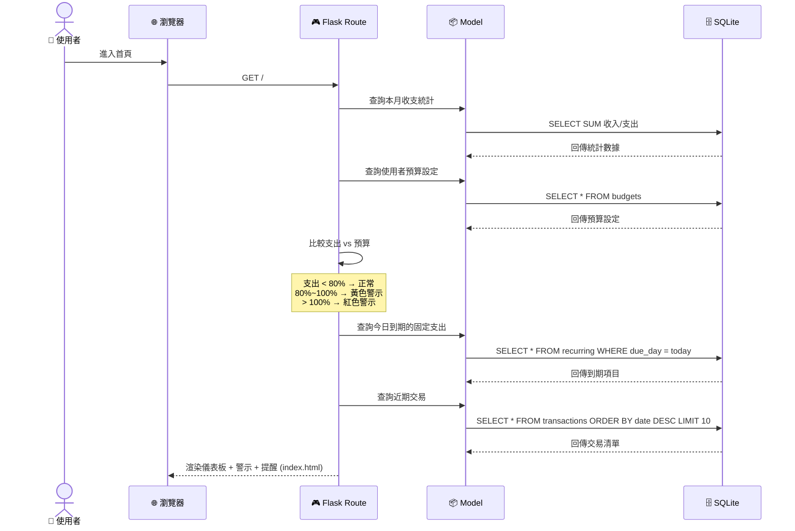

---

### 2.4 使用者註冊與登入序列圖

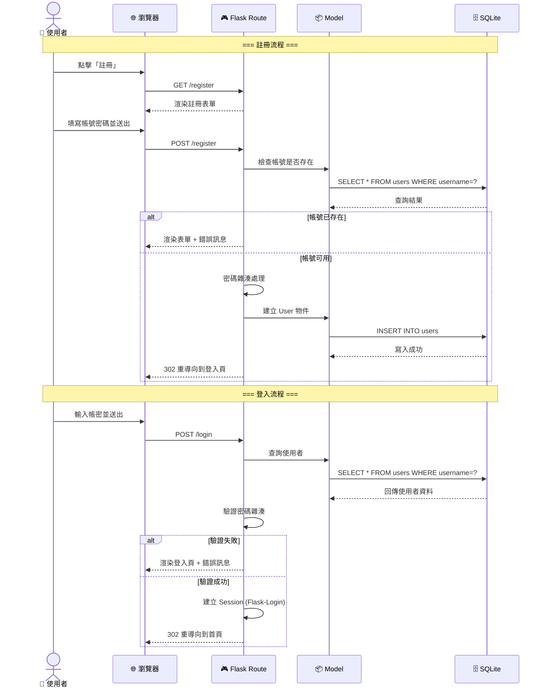

---

## 3. 功能清單對照表

| # | 功能名稱 | URL 路徑 | HTTP 方法 | 說明 |
|---|---------|---------|-----------|------|
| 1 | 首頁儀表板 | `/` | GET | 顯示餘額、本月收支、近期交易、預算警示、固定支出提醒 |
| 2 | 新增帳目（表單） | `/transaction/new` | GET | 顯示記帳表單 |
| 3 | 新增帳目（送出） | `/transaction/new` | POST | 處理表單送出，新增交易紀錄 |
| 4 | 歷史帳目列表 | `/transactions` | GET | 顯示所有帳目，支援篩選搜尋與分頁 |
| 5 | 編輯帳目（表單） | `/transaction/<id>/edit` | GET | 顯示編輯表單，帶入既有資料 |
| 6 | 編輯帳目（送出） | `/transaction/<id>/edit` | POST | 處理表單送出，更新交易紀錄 |
| 7 | 刪除帳目 | `/transaction/<id>/delete` | POST | 刪除指定帳目（需確認） |
| 8 | 統計分析 | `/statistics` | GET | 顯示圓餅圖與分類統計表格 |
| 9 | 統計資料 API | `/statistics/data` | GET | 回傳指定月份的分類統計 JSON（供 Chart.js 使用） |
| 10 | 預算設定頁面 | `/budget` | GET | 顯示目前預算設定 |
| 11 | 更新預算 | `/budget` | POST | 儲存預算設定 |
| 12 | 固定支出管理 | `/recurring` | GET | 顯示所有週期性支出項目 |
| 13 | 新增固定支出 | `/recurring/new` | POST | 新增週期性支出項目 |
| 14 | 編輯固定支出 | `/recurring/<id>/edit` | POST | 修改固定支出項目 |
| 15 | 刪除固定支出 | `/recurring/<id>/delete` | POST | 刪除固定支出項目 |
| 16 | 暫停/恢復提醒 | `/recurring/<id>/toggle` | POST | 切換固定支出的提醒狀態 |
| 17 | 一鍵記帳 | `/recurring/<id>/record` | POST | 將到期的固定支出轉為實際帳目 |
| 18 | 使用者註冊（表單） | `/register` | GET | 顯示註冊表單 |
| 19 | 使用者註冊（送出） | `/register` | POST | 處理註冊，建立帳號 |
| 20 | 使用者登入（表單） | `/login` | GET | 顯示登入表單 |
| 21 | 使用者登入（送出） | `/login` | POST | 驗證帳密，建立 Session |
| 22 | 使用者登出 | `/logout` | GET | 清除 Session，重導向到登入頁 |

---

> 📌 **下一步**：本文件確認後，進入 **資料庫設計（DB Schema）** 階段。
